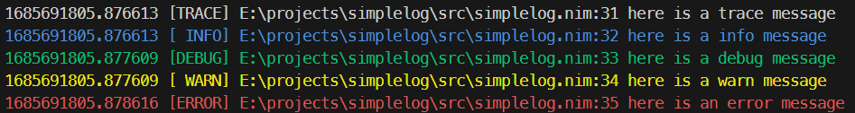
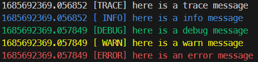

# simplelog

A deadly simple log package.

Perform differently in different build modes:

<strong> `when not defined(release) and not defined(js):`</strong>



<strong>`when defined(release):` (without filename and number of line)</strong>




Choose your own timer:

```nim
# demo.nim

import std / times

import simplelog

simplelog.timer =
  proc(): string =
    $now().utc

when isMainModule:
  debug("different timer")
```

```shell
nim c -r demo.nim
```

output:

<font color="green">
2023-06-02T08:02:33Z [DEBUG] E:\projects\simplelog\demo.nim:12 different timer
</font>

todo:

- [ ] Log level
- [ ] ...whatever(lazy I am)
